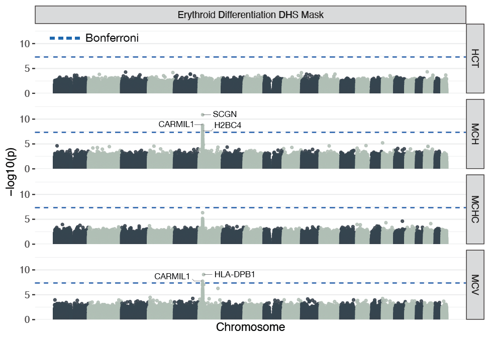

```{r, include = FALSE}
knitr::opts_chunk$set(
  collapse = TRUE,
  comment = "#>",
  message = FALSE,
  warning = FALSE
)
```

```{r setup}
library(GenomicRanges)
library(smer)
```

# DNAse I hypersensitive sites of erythroid differentiation reveal statistical epistasis in human hematology traits

We apply SME to hematology traits of white British individuals from the
UK Biobank. After quality control, the remaining data are  349,411 individuals
and 543,813 SNPs of common variants. We select the traits mean
corpuscular hemoglobin (MCH), mean corpuscular hemoglobin concentration, mean
corpuscular volume (MCV), and hematocrit (HCT).
As external sparse data source, we leverage DNase I-hypersensitive sites (DHSs)
data measured over 12 days of ex-vivo erythroid
differentiation (Georgolopoulos et al. 2024). DHS are enriched in transcriptional activity and used
to identify regulatory DNA.

The first three traits, MCH, MCHC, and MCV are traits of the red blood cells
(RBC). Previous GWAS studies found that genes associated with these
traits are implicated in erythroid differentiation. Therefore,
we expect that genomic data that indicates regulatory regions gathered
during erythropoiesis will be informative for these traits. HCT measures the
percentage of red blood cells in the blood.
The maturation of erythroid progenitor cells is regulated by an oxygen-sensing
mechanism. We hypothesise that
HCT, is not informed by functional data of erythropoiesis.

## Mask File Preparation

The external data sources used in this study represented genomic intervals
of DHS regions and LD blocks. In the following we mock this data to illustrate
how to create a mask file for `sme()`.
See [How To Create a Mask File](https://lcrawlab.github.io/sme/articles/tutorial-create-mask-file.html) for
more details.

```{r bim_data}
bim_data <- data.frame(
  chromosome = c(1, 1, 1, 2, 2, 2, 3, 3, 3),
  variant_id = c("rs1", "rs2", "rs3", "rs4", "rs5", "rs6", "rs7", "rs8", "rs9"),
  cm_position = c(0, 0, 0, 0, 0, 0, 0, 0, 0),
  bp_position = c(10, 20, 30, 40, 50, 60, 70, 80, 90),
  allele1 = c("A", "A", "A", "G", "C", "C", "T", "T", "A"),
  allele1 = c("G", "G", "G", "A", "T", "T", "A", "A", "G")
)
bim_data$index <- 1:nrow(bim_data)

# DHS intervals
hg19_dhs_regions <- data.frame(
  chromosome = c(1, 2, 3),
  start = c(5, 45, 85),
  stop = c(15, 55, 95)
)

# LD block intervals
hg19_ld_blocks <- data.frame(
  chromosome = c(1, 1, 2, 2, 3, 3, 3),
  start = c(5, 25, 35, 45, 65, 75, 85),
  stop = c(25, 35, 45, 65, 75, 85, 95)
)
```

We make use of the package `GenomicRanges` to efficiently map the `PLINK` data
to the intervals of the DHS and LD data.

```{r dhs_data}
# Convert .bim to GRanges object
bim_gr <- GRanges(
  seqnames = paste0("chr", bim_data$chromosome),
  ranges = IRanges(start = bim_data$bp_position, end = bim_data$bp_position),
  variant_id = bim_data$variant_id,
  genome = "hg19"
)

# Convert DHS to GRanges object
dhs_gr <- GRanges(
  seqnames = paste0("chr", hg19_dhs_regions$chromosome),
  ranges = IRanges(start = hg19_dhs_regions$start, end = hg19_dhs_regions$stop),
  genome = "hg19"
)

# Find overlaps of BIM variants and DHS intervals
overlaps <- findOverlaps(bim_gr, dhs_gr, maxgap = 0)

# Extract overlapping variants
dhs_data <- bim_data[queryHits(overlaps), ]
dhs_data <- dhs_data[!duplicated(dhs_data$index), ]
```

Of the 543,813 SNPs in our data, 4,932 are located in the DHS regions. The DHS
regions in this data are distributed along the whole genome. To test for
marginal epistasis with SME we consider the variants in the DHS regions
important.

Next we map the `PLINK` data to the LD blocks.

```{r}
# Convert to GRanges object
ld_gr <- GRanges(
  seqnames = paste0("chr", hg19_ld_blocks$chromosome),
  ranges = IRanges(start = hg19_ld_blocks$start, end = hg19_ld_blocks$stop),
  genome = "hg19"
)

# Find LD block of bim variants
ld_overlaps <- findOverlaps(query = bim_gr, subject = ld_gr)
```

With these objects, we can create the mask file. With
larger data, we recommend splitting the `PLINK` variants that are analyzed into
batches, create one mask file per batch, and submit one job per batch on a
High Peformance Cluster.

```{r write_mask}
output_file <- tempfile()
gxg_group <- "gxg"
ld_group <- "ld"

gxg_variants <- dhs_data$index - 1 # 0-base index for C++

create_hdf5_file(output_file)

for (j in bim_data$index - 1) { # 0-base index for C++
  # Write DHS mask
  gxg_ds <- sprintf("%s/%d", gxg_group, j)
  write_hdf5_dataset(file_name = output_file,
                     dataset_name = gxg_ds,
                     gxg_variants)

  # Find LD block of focal SNP
  focal_gr <- ld_gr[subjectHits(ld_overlaps[j,])]

  # Find variants in LD block of focal SNP
  focal_ld <- findOverlaps(query = bim_gr, subject = focal_gr)
  ld_data <- bim_data[queryHits(focal_ld),]
  ld_variants <- ld_data$index - 1 # 0-base index for C++

  # Write LD mask
  ld_ds <- sprintf("%s/%d", ld_group, j)
  write_hdf5_dataset(file_name = output_file,
                     dataset_name = ld_ds,
                     ld_variants)
}

dhs_indices <- read_hdf5_dataset(file_name = output_file, dataset_name = gxg_ds)
print(sprintf("DHS indices: %s", paste(dhs_indices, collapse = ", ")))
```

With this mask file we can run SME.

```{r run_sme, eval = FALSE}
sme_result <- sme(
  plink_file = "/path/to/plink/data",
  pheno_file = "/path/to/pheno/data",
  mask_file = "/path/to/mask/file",
  gxg_indices = c(1, 2, 3),
  chunk_size = 250,
  n_randvecs = 10,
  n_blocks = 200,
  n_threads = 6
)
```

The genome-wide association test for marginal epistasis in the red blood cell
traits MCH and MCV finds genome-wide significant statistical epistasis ($P
< \num{5e-8}$) on chromosome 6 (Fig. 1).
Importantly, most of the SNPs or the genes which they map to have been
previously discovered for non-additive gene action related to erythropoiesis
and RBC traits.


# 
**Figure 1.** Manhattan plot of the SME analysis. The dashed blue line is the
significance threshold after Bonferroni correction.

The strongest association in the trait MCH, SNP rs4711092 ($P =
\num{1.41e-11}$, PVE 0.7\%), maps to the
gene secretagogin (\textit{SCGN}). The gene \textit{SCGN} regulates exocytosis
by interacting with two soluble NSF adaptor
proteins (\textit{SNAP-25} and \textit{SNAP-23}) and is critical for cell
growth in some tissues.
A total of five SNPs which SME significantly associates
with MCH (strongest association with rs9366624 $P = \num{1.8e-9}$, PVE 1.1\%)
are in the gene capping protein regulator and myosin 1 linker 1
(\textit{CARMIL1}).
The gene \textit{CARMIL1} is known to interact with and regulate
caping protein (\textit{CP}). \textit{CP}
plays a role via protein-protein interaction in regulating
erythrpoiesis\cite{ray_functional_2022}. Specifically, \textit{CARMIL} proteins
regulate actin dynamics by regulating the activity of
\textit{CP}. Erythropoiesis leads to modifications in the expression
of membrane and cytoskeletal proteins, whose interactions impact cell structure
and function.
Both genes \textit{SCGN} and \textit{CARMIL1} have previously been associated
with hemoglobin concentration\cite{timoteo_common_2023, ding_genetic_2012}.
The strongest association in the trait MCV, SNP rs9276 ($P = \num{9.09e-10}$,
PVE 0.24\%) maps to the gene \textit{HLA-DBP1} of the major histocompatibility
complex. With the SNP rs9366624 ($P = \num{1.86e-8}$, PVE 0.8\%), also the gene
\textit{CARMIL1} is significantly associated with the trait for marginal
epistasis. The complete list of significant associations produced by SME is
reported in Tab. 1.


| **Trait** | **ID**    | **Coordinates** | **$P$-Value**    | **PVE**        | **Gene**  |
|-----------|-----------|-----------------|------------------|----------------|-----------|
| MCH       | rs4711092 |   chr6:25684405 | $\num{1.41e-11}$ | 0.007 (0.0009) | *SCGN*    |
| MCH       | rs9366624 |   chr6:25439492 | $\num{1.8e-9}$   | 0.011 (0.002)  | *CARMIL1* |
| MCH       | rs9461167 |   chr6:25418571 | $\num{2.34e-9}$  | 0.007 (0.001)  | *CARMIL1* |
| MCH       | rs9379764 |   chr6:25414023 | $\num{5.53e-9}$  | 0.012 (0.002)  | *CARMIL1* |
| MCH       | rs441460  |   chr6:25548288 | $\num{1.2e-8}$   | 0.008 (0.001)  | *CARMIL1* |
| MCH       | rs198834  |   chr6:26114372 | $\num{2.77e-8}$  | 0.008 (0.001)  | *H2BC4*   |
| MCH       | rs13203202|   chr6:25582771 | $\num{3.17e-8}$  | 0.012 (0.002)  | *CARMIL1* |
| MCV       | rs9276    |   chr6:33053577 | $\num{9.09e-10}$ | 0.0024 (0.0004)| *HLA-DPB1*|
| MCV       | rs9366624 |   chr6:25439492 | $\num{1.86e-8}$  | 0.008 (0.001)  | *CARMIL1* |
**Table 1.** Significant trait associations for marginal epistasis.


Fitting the linear mixed model of SME also produces narrow-sense heritability
estimates equivalent to RHE regression. The heritability
estimates of SME for the four traits in this study are similar
to heritability estimates found in the literature(Tab. 2).

| **Trait** | **$h^2$**      |
|-----------|-------------|
|	HCT       | 0.28 (0.01) |
|	MCH       | 0.56 (0.03) |
|	MCHC      | 0.14 (0.01) |
|	MCV       | 0.52 (0.03) |
**Table 2.** Narrow-sense heritability ($h^2$) estimates in the SME analysis.

# References
- Stamp J, Smith Pattillo S, Weinreich D, Crawford L (2025). Sparse modeling of 
  interactions enables fast detection of genome-wide epistasis in biobank-scale 
  studies. biorxiv, <https://doi.org/10.1101/2025.01.11.632557>
- Georgolopoulos, G. GEO Data Set: Discrete regulatory modules instruct
  hematopoietic lineage commitment and differentiation
  <https://www.ncbi.nlm.nih.gov/geo/query/acc.cgi?acc=GSE182816> (2024).

# SessionInfo

```{r sessinfo}
sessionInfo()
```
