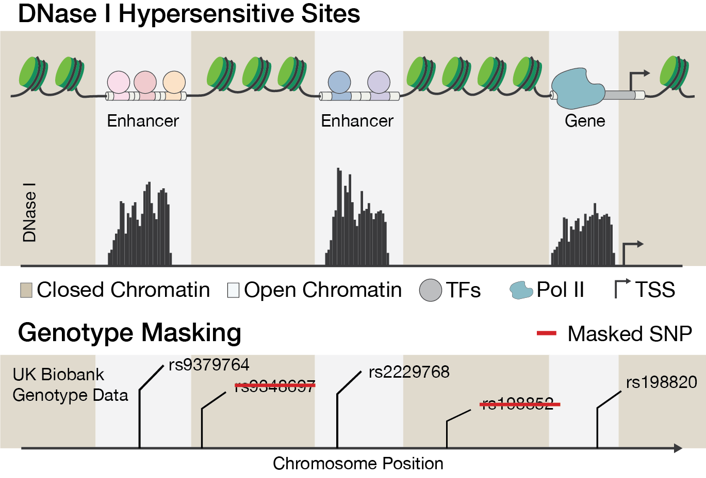

```{r, include = FALSE}
knitr::opts_chunk$set(
  collapse = TRUE,
  comment = "#>"
)
```

```{r setup}
library(smer)
```


The Sparse Marginal Epistasis test (SME) requires a HDF5 file containing
binary masking data. The effectiveness of the test relies on how informative the
mask is for a specific trait. For instance, to test for marginal epistasis
related to transcriptional activity, DNase I hypersensitivity sites data can be
used to condition the detection on accessible chromatin regions.


**Figure 1.** The illustration shows open chromatin data. DNase I hypersensitive
sites indicate transcriptional activity. The DNase-seq signal is converted to a
binary mask, where genetic variants in inaccessible chromatin regions are
excluded from the covariance matrix for marginal epistasis.


## Mask File Format

The `sme()` function expects the mask data to be in an HDF5 file. The HDF5
format includes two primary object types:

- Datasets - typed multidimensional arrays
- Groups - container structures that can hold datasets and other groups

## Mask Format Requirements

The mask data should be organized into the following groups and datasets:

**Groups**:

- `ld`: Contains SNPs in linkage disequilibrium (LD) with the focal SNP, which
  will be **excluded**.
- `gxg`: Contains indices of SNPs used to condition the marginal epistasis test,
  which will be **included**.

The required group names can be configured as input parameters of `sme()`.
The defaults are `ld` and `gxg`.

**Datasets**:

- `ld/<j>`: For each focal SNP `<j>`, this dataset contains indices of SNPs in
  the same LD block as that SNP. These SNPs will be **excluded** from the
  gene-by-gene interaction covariance matrix.
- `gxg/<j>`: For each focal SNP `<j>`, this dataset contains indices of SNPs to
  **include** in the the gene-by-gene interaction covariance matrix for focal
  SNP `<j>`.

**Important**: All indices in the mask file must be **zero-based** and should
correspond to the zero-based row indices of the PLINK `.bim` file. This includes
the dataset index (`<j>` in `gxg/<j>`) and the data itself.
This zero-based indexing is necessary because the mask data is read by a C++
subroutine in
`sme()`, which uses zero-based indexing, unlike R's one-based indexing for SNP
indices in the function call.

## Creating and Using Mask Files

The package provides utility functions to create, write, and read valid mask
files for `sme()`.


```{r}
hdf5_file <- tempfile()

# Group names
gxg_h5_group <- "gxg"
ld_h5_group <- "ld"

# Data (still in 1-based R indexing)
include_gxg_snps <- 1:10
exclude_ld_snps <- 5:6

# Focal SNP (still in 1-based R indexing)
focal_snp <- 4

# Dataset names
dataset_name_pattern <- "%s/%s"
# 0-based index!
gxg_dataset <- sprintf(dataset_name_pattern, gxg_h5_group, focal_snp - 1)
ld_dataset <- sprintf(dataset_name_pattern, ld_h5_group, focal_snp - 1)

# Create an empty HDF5 file
create_hdf5_file(hdf5_file)

# Write LD data
write_hdf5_dataset(hdf5_file, ld_dataset, exclude_ld_snps - 1) # 0-based index!

# Write GXG data
write_hdf5_dataset(hdf5_file, gxg_dataset, include_gxg_snps - 1)
```

We can check that the data was written correctly.

```{r}
ld_read <- read_hdf5_dataset(hdf5_file, ld_dataset)
gxg_read <- read_hdf5_dataset(hdf5_file, gxg_dataset)

print(sprintf("Zero-based indices of SNPs to exclude: %s", str(ld_read)))
print(sprintf("Zero-based indices of SNPs to include: %s", str(gxg_read)))
```

## SessionInfo

```{r seesionInfo}
sessionInfo()
```

